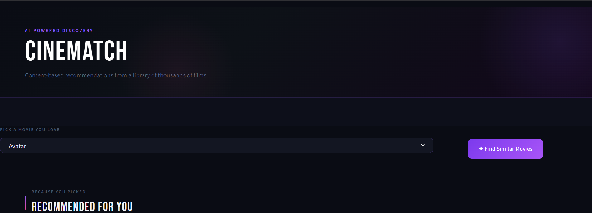
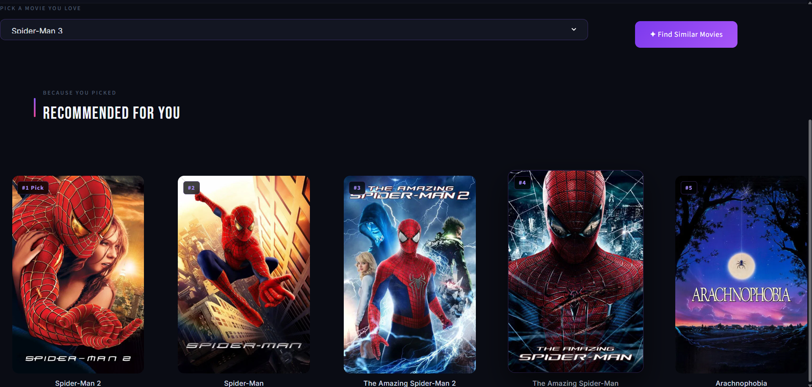
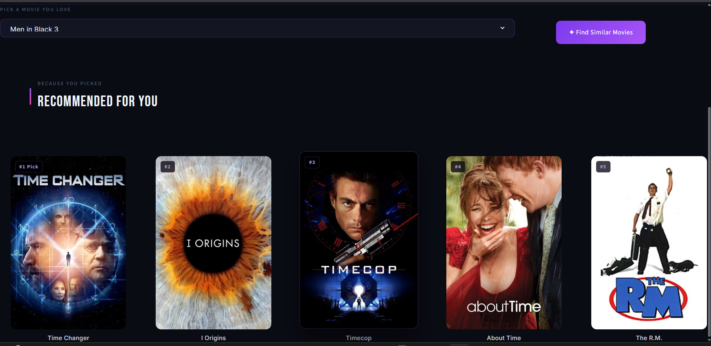

# 🎬 CINEMATCH - Movie Recommendation System

An AI-powered Content-Based Movie Recommendation System built using Python, Streamlit, Machine Learning, and TMDB API.


## 🚀 Features

- Content-Based Filtering
- Cosine Similarity Recommendation Engine
- TMDB Movie Posters
- Interactive Streamlit UI
- Dark Modern Theme
- Top 5 Similar Movie Suggestions


## 🛠️ Technologies Used

- Python
- Pandas
- NumPy
- Scikit-Learn
- Streamlit
- TMDB API

## How It Works

User Selects Movie
↓
Movie Converted To Vector
↓
Cosine Similarity Calculated
↓
Top 5 Similar Movies Found
↓
TMDB API Fetches Posters
↓
Recommendations Displayed


## Dataset

The recommendation model is built using the TMDB Movie Dataset.

Features used:
- Movie Title
- Genres
- Keywords
- Cast
- Crew
- Overview

The dataset was preprocessed and transformed into vectors using NLP techniques.


## 📸 Screenshots

### Homepage


### Recommendation 1


### Recommendation 2


## 📊 Project Highlights

- Content-Based Recommendation System
- 5000+ Movies Dataset
- Cosine Similarity Engine
- TMDB API Integration
- Interactive Streamlit UI
- Top 5 Similar Movie Suggestions


## ⚙️ Installation

Clone the repository:

```bash
git clone https://github.com/NishiChauhan26/Movie-Recommendation-System.git
```

Install dependencies:

```bash
pip install -r requirements.txt
```

Run the application:

```bash
streamlit run app.py
```


## 📊 Recommendation Technique

The system uses:

- Content-Based Filtering
- Text Vectorization
- Cosine Similarity

to identify movies with similar characteristics and recommend them to users.

## Future Improvements

- User Authentication
- Collaborative Filtering
- Personalized Recommendations
- Watchlist Feature
- Movie Search by Genre
- Streamlit Cloud Deployment

--------------------------------------------------------------------------------------------------------------------------------------------

## 👨‍💻 Author

## Author

Nishi Chauhan

Final Year Student
Aspiring AI & Machine Learning Engineer

GitHub:
https://github.com/NishiChauhan26
